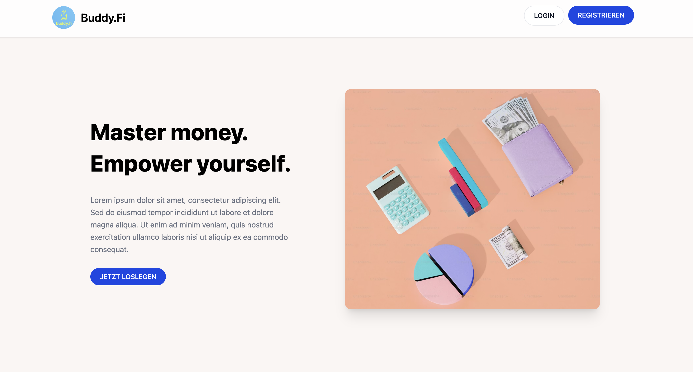
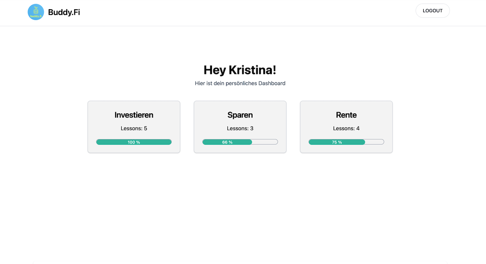
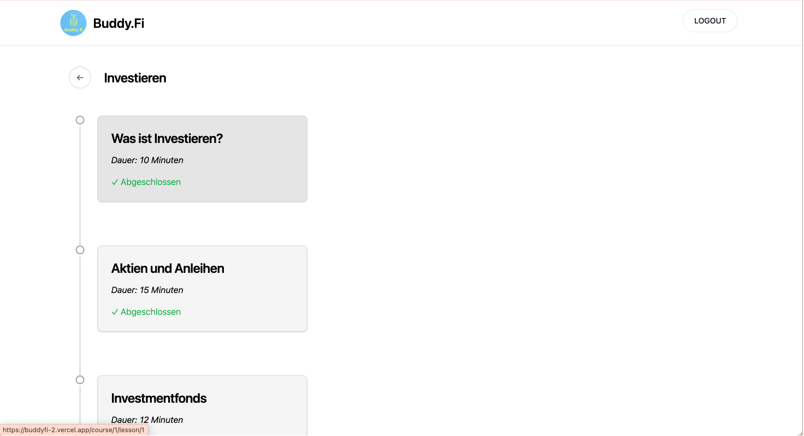
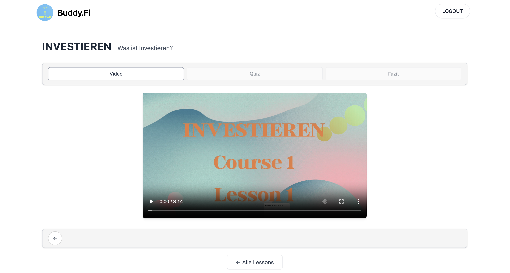
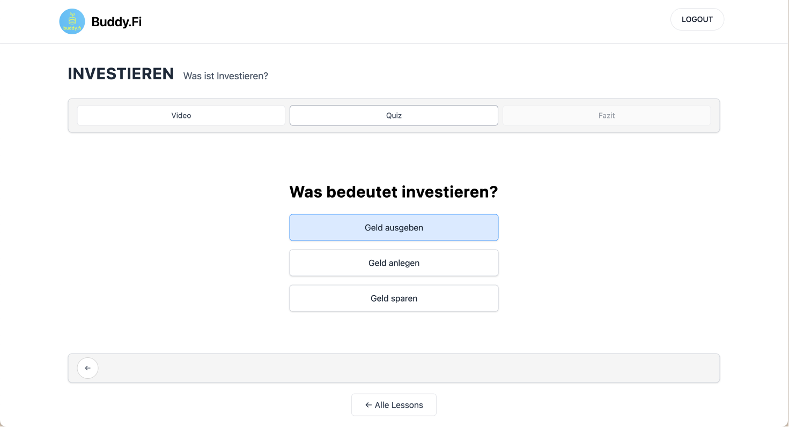
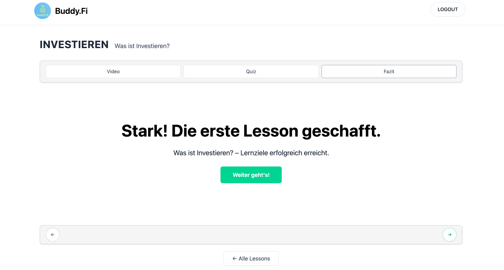
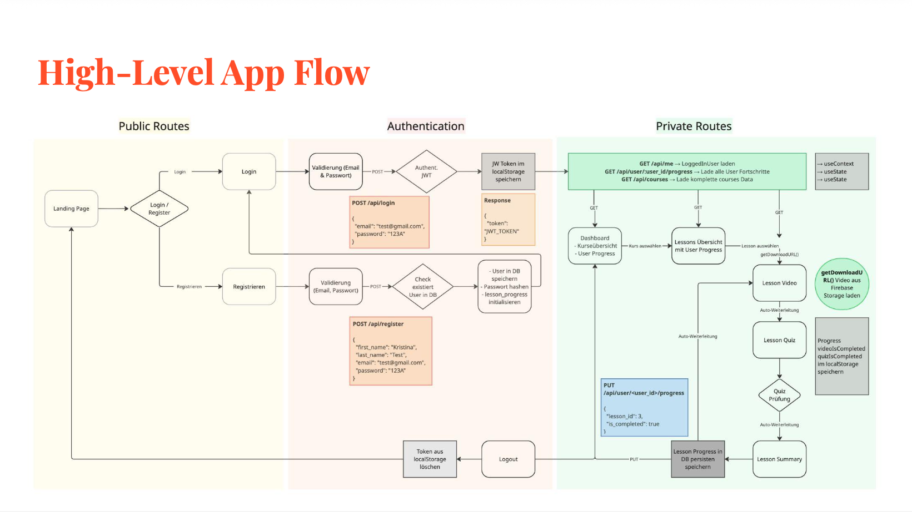
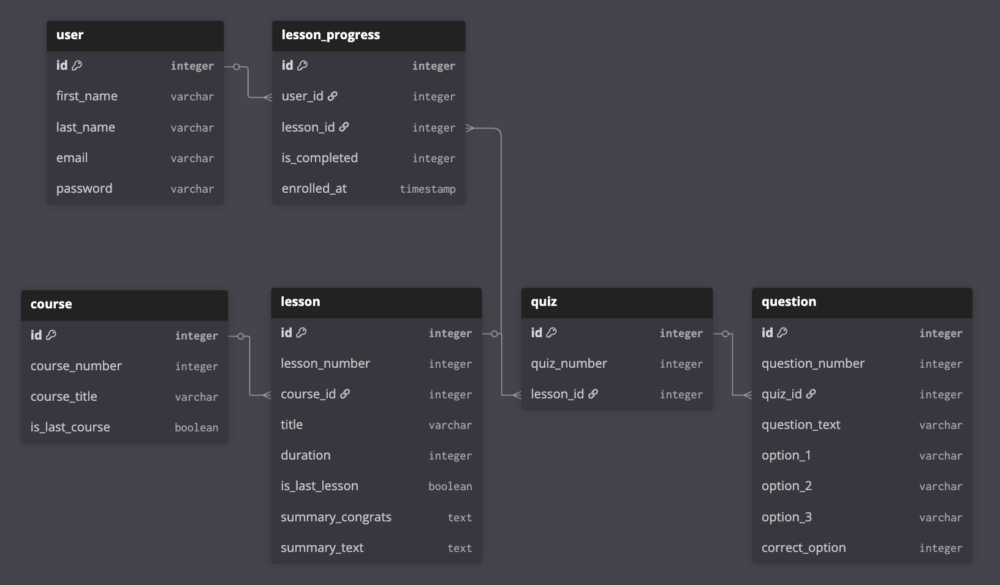
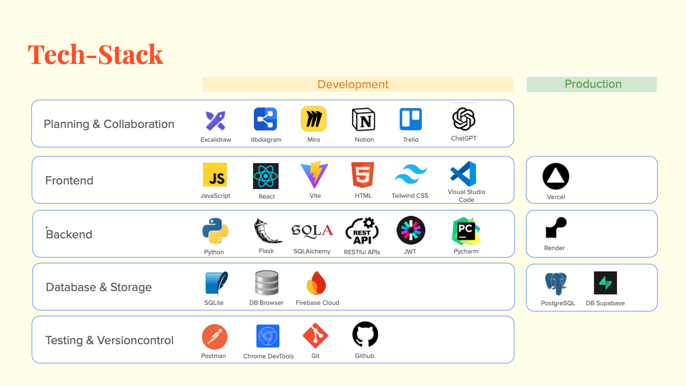

# Buddy.Fi – Financial Microlearning Platform

Full-Stack Portfolio Project (Work in Progress)

  

Buddy.Fi is a full-stack web application inspired by Duolingo, designed to make financial education structured, engaging, and scalable through microlearning.
It combines educational content, gamification principles, and progress tracking to help users build financial confidence — one lesson at a time.

This is an MVP version currently running with mock data for demonstration purposes.
Focus: full-stack architecture, learning flow logic, and scalable system design.

---

## Repository Structure
This repository serves as the main hub for Buddy.Fi.  

### Frontend Repository
React-based UI, routing, and client-side logic.
- [Frontend Repository](https://github.com/kristina-krauberger/budifi-frontend)

### Backend Repository
Flask REST API handling authentication, courses, and lesson progress.
- [Backend Repository](https://github.com/kristina-krauberger/budifi-backend)
  
---

## User Dashboard

  

Users can track their learning progress across multiple finance courses with real-time progress bars and completion tracking.

---

## Courses

  

The Courses view dynamically renders all available courses fetched from the REST API.

Each course card is generated from relational database data and includes:

- Course metadata (title, description, order)
- Associated lessons
- User-specific completion state (via LessonProgress)
- Dynamic routing via `/course/:courseId`

This architecture allows new courses to be added in the database without changing frontend logic.

---

##  Lesson Flow (Duolingo-Inspired)

  

Each lesson follows a structured learning path:

Video → Quiz → Summary → Next Lesson
Lesson progression is controlled via completion state logic and dynamic routing (`/course/:courseId/lesson/:lessonNumber`), ensuring users unlock content sequentially.

---

## Interactive Quiz System

  

---

## Completion Feedback

  

Positive reinforcement strengthens learning motivation and habit formation.

Users answer questions after each lesson to reinforce knowledge and unlock the next stage.

---

## Live Demo

Frontend (Production):
https://buddyfi-2.vercel.app/

Backend runs locally for MVP demonstration (architecture focus over deployment setup).

---

## The Problem

Traditional financial coaching is:

- Not scalable  
- Expensive  
- Overwhelming  
- Dependent on 1:1 consulting  
- Often filled with complex terminology  

Many learners need structure, clarity, and self-paced guidance instead of information overload.

---

## The Mission

Buddy.Fi democratizes financial education through:

- Microlearning principles  
- Gamified lesson flow  
- Self-paced progress  
- Structured learning roadmap  
- Empowerment instead of dependency  

---

## High-Level Architecture

The application follows a modular full-stack architecture:

- React frontend (Vite + Tailwind)
- Flask REST API backend
- SQLAlchemy ORM
- SQLite (development)
- JWT-based authentication (implementation prepared)

### Learning Flow Logic

Video → Quiz → Summary → Next Lesson → Next Course → Dashboard

Inspired by Duolingo-style microlearning navigation.

---

## Data Model & Storage Strategy

The backend uses relational data modeling with foreign keys, designed for scalability

Core entities:

- User
- Course
- Lesson
- LessonProgress
- Quiz
- Question

Design principles:

- Modular structure
- Clear separation of concerns
- REST-ready architecture
- Scalable database relationships
- Persistent progress tracking per user

---

## API Design

Key endpoints:

POST   /api/register
POST   /api/login
GET    /api/me
GET    /api/courses
GET    /api/user/<int:user_id>/progress
PUT    /api/user/<int:user_id>/progress

JWT authentication structure is implemented and prepared for route protection.

---

## State Management Strategy (Frontend)

- React Context API for global user state
- Local component state for lesson logic
- localStorage for persistence
- Centralized Axios configuration
- Clean separation between UI and API layer

The architecture ensures scalability and avoids large monolithic components.

---

## Tech Stack

### Frontend
- React 18
- Vite
- React Router
- Tailwind CSS
- Axios
- Context API
- Vercel (Deployment)

### Backend
- Python 3
- Flask
- SQLAlchemy
- SQLite
- JWT
- dotenv

---

## Roadmap

Next Steps:

- Secure all endpoints with JWT middleware
- Introduce badge & streak system
- Dashboard analytics & progress visualization
- AI-powered lesson
- Payment integration

---

## About This Project

Buddy.Fi is both a technical full-stack project and a product-driven concept.

It demonstrates:

- System thinking
- API design
- Scalable database modeling
- Clean frontend architecture
- Learning flow UX logic

This project is part of my Full-Stack Software Engineering journey and reflects my interest in financial technology and educational platforms.

